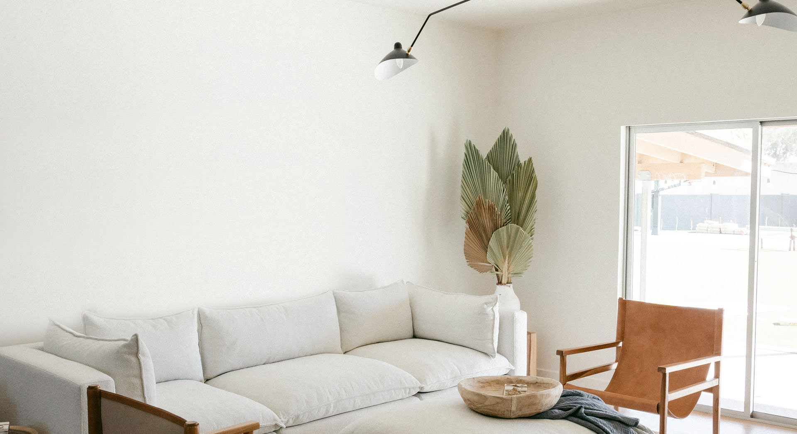

# Interno - Interior Design Website



**Modern and elegant interior design landing page** built with pure **HTML & CSS**.

---

## ✨ Live Demo

**[👉 View Live Website](https://haidygerges.github.io/interno)**

---

## ✨ Features

- Fully Responsive Design (Mobile + Tablet + Desktop)
- Beautiful Hero Section with Overlay
- Services Section (Interior Design, Furniture, Flooring)
- "We Tackle The Most Challenging Designs" Section
- Customer Testimonials
- Recent Blog Posts Grid
- Smooth Hover Animations & Transitions

---

## 🛠 Technologies

- HTML5
- CSS3 (Flexbox + Grid + CSS Variables)
- Fully Responsive (Mobile-First)

---

## 📁 Project Structure

```bash
interno/
├── index.html
├── css/
│   └── style.css
├── images/
│   ├── HERO-SETION.jpg
│   ├── client-image-1.jpg
│   ├── client-image-2.jpg
│   ├── client-image-3.jpg
│   └── ...
├── README.md
└── .gitignore

2ز
